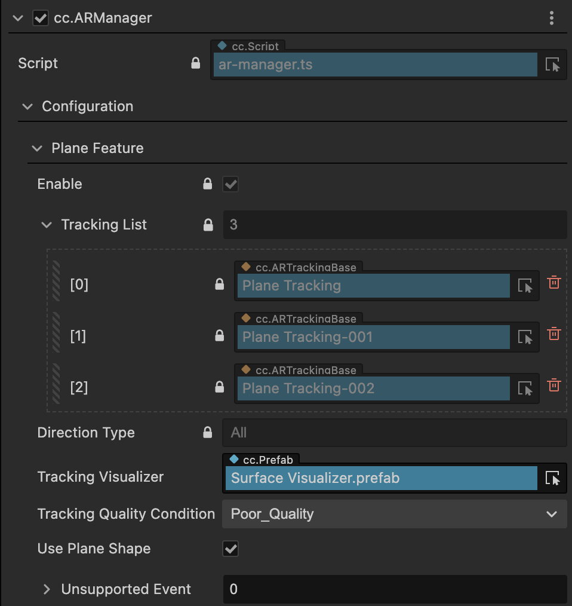

# AR Manager

The AR module of Cocos CreatorXR provides a global manager for collecting and managing the AR features used in the current project. Each feature in the feature manager has global properties, and adjusting these parameters will modify the device-specific or project-wide functionality. The `cc.ARManager` is automatically attached to the `XR Agent` node by default. When you create AR automation behavior nodes, the `ARManager` will collect these nodes into their corresponding feature lists for easy management and maintenance of all feature nodes.

The corresponding global feature properties are provided for the supported AR features in the current version.

## Plane Tracking

When you create one or more Plane Tracking nodes in the scene, the `Configuration` in the `ARManager` will have an additional `Plane Feature` property. You can adjust the parameters under the feature or locate the corresponding feature node.




- `Direction Type`: Collects the orientations of all plane proxies that need to be recognized in the current scene.

- `Tracking Visualizer`: Creates default visualization models for all plane proxies.

- `Tracking Quality Condition`:  Represents the minimum quality of the tracked plane proxy. When the stability quality is below this value, the plane will not be visualized.

- `Use Plane Shape`: When enabled, the visualization effect will use polygon rendering based on the real physical shape of the plane in the real environment. When disabled, quad rendering will be used instead.

- `Unsupported Event`: Triggered when plane tracking is not supported by the device. Users can add events according to their needs.

## Image Tracking

When you create one or more `Image Tracking` nodes in the scene, the `Configuration` in the `ARManager` will have an additional `Image Feature` property. You can adjust the parameters under the feature or locate the corresponding feature node.


The `Max Tracking Number` on each platform represents the maximum number of images that can be simultaneously tracked within the camera's field of view. This value can be dynamically modified as needed.

Note: The upper limit of `Max Tracking Number` varies depending on the device platform. Currently known limits are:

- ARCore: The platform can track up to 20 images simultaneously, with a maximum inventory of 1000 individual images.
- ARKit: The platform can track up to 4 images simultaneously, with a maximum inventory of 100 images.
- AREngine: The platform can track up to 1 image simultaneously.

The `Unsupported Event` will be triggered when image tracking is not supported by the device. Users can add events according to their needs.

## Meshing（Experimental）

When you create one or more `Meshing` nodes in the scene, the `Meshing Feature` property will be added to the `ARManager`'s configuration. Since the Meshing feature is experimental and requires high hardware requirements for environmental reconstruction, it does not currently support parameter control for this feature.


`Normals` are enabled by default, allowing you to obtain normal vectors based on the mesh information.

## APIs

`ARManager` also provides interfaces to control feature switches and feature visualization switches:

```typescript
public enableFeatureTracking (type: ARTrackingType, enable: boolean);
public showAllVisualizer (type: ARTrackingType);
public hideAllVisualizer (type: ARTrackingType);
```
