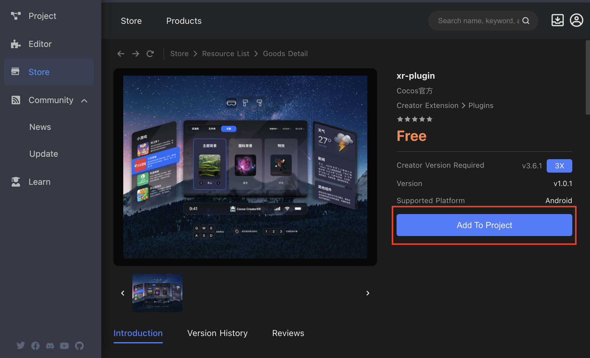
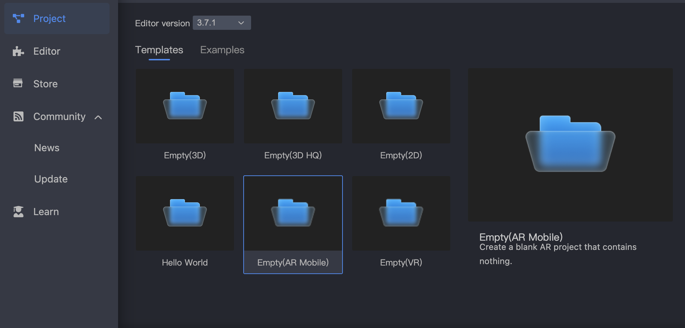
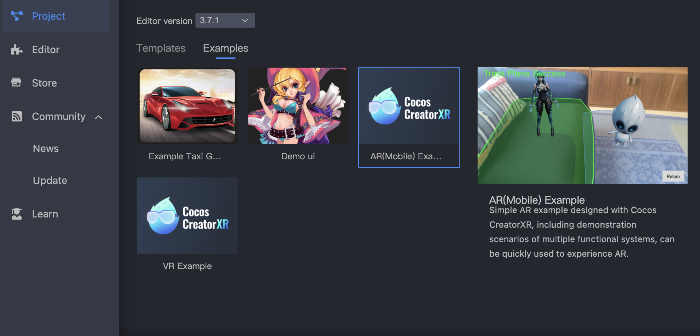
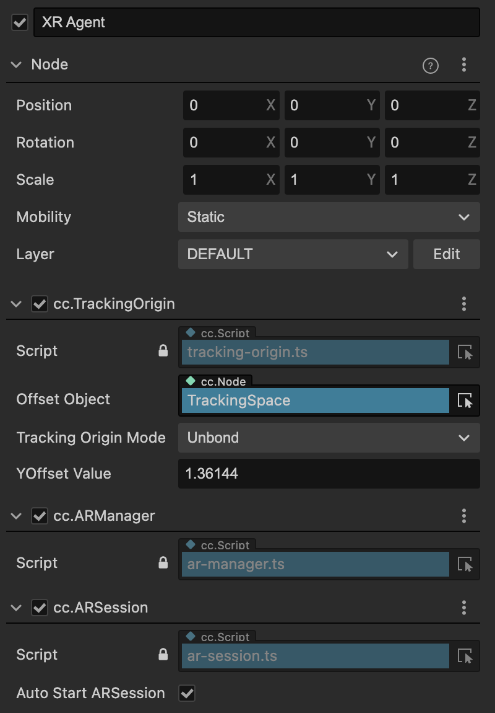
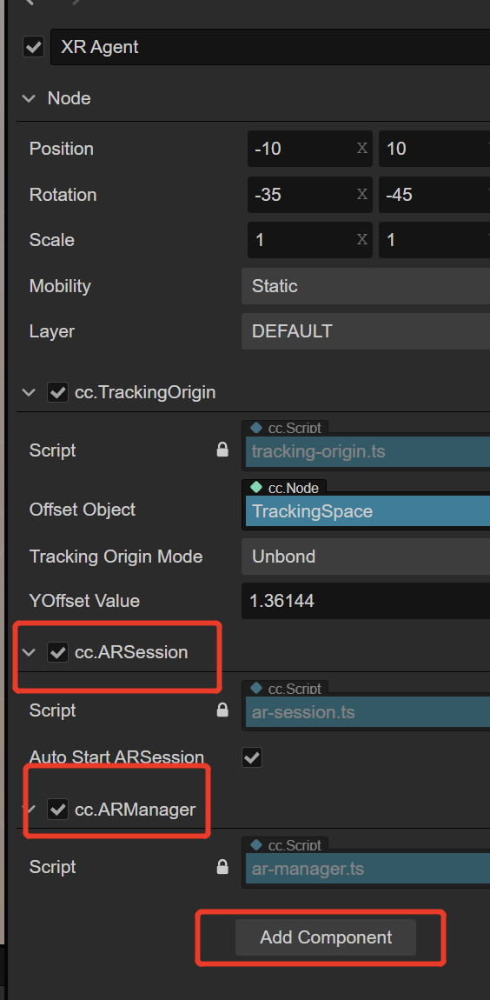
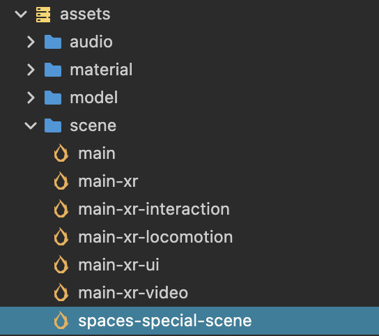
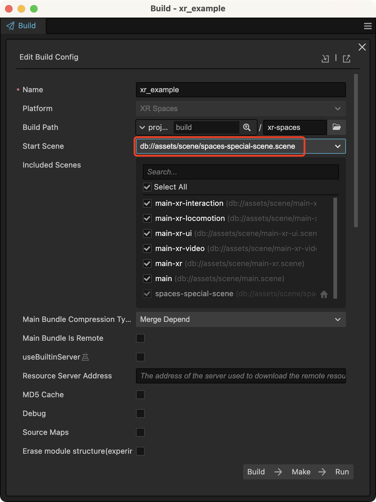

# AR Project Creation

Follow the steps below to set up AR-related features for your project.

Three methods are provided, and you can choose any one of them to set up the extension or open the built-in AR project directly.

## 1. Apply xr-plugin to the Project

Search for xr-plugin in the Cocos Store, obtain the extension, and install it. For detailed installation instructions, please refer to the [Extension Install Documentation](../../../editor/extension/install)。

After installation, add the extension to the corresponding project.

This method is suitable for migrating XR mode to existing 3D projects.

## 2. Two Ways to Create from AR Project

### Create from AR Template

Create a new project in the Cocos Dashboard, select editor version v3.7.1 or higher, and choose **Templates/Empty (AR Mobile)** as the template for creation.

Open the project and go to the scene. The scene already includes the initial AR Camera configuration, allowing you to directly develop functionalities.

### Create from AR Example

Create a new project in the Cocos Dashboard, select editor version v3.7.1 or higher, and choose **Examples/AR (Mobile) Example** as the example for creation.

The example project contains complete XR-related features for the current version of the extension, allowing you to directly build and experience. For AR application building and publishing instructions, please refer to [Build and Publish](ar-proj-pub.md).

## 3. Scene Configuration

If you choose the first method of applying **xr-plugin** to the project to get AR ability, you also need to follow the steps below to complete the basic AR feature configuration for a regular 3D scene.

Each AR scene in the application must include two key objects: XR Agent and AR Camera.

We recommend two methods to configure the scene, and you can choose either one:

1. Right-click in the Hierarchy and select **Create XR -> XR Agent**. Select the XR Agent node, right-click to create an Empty Node, and rename it to **TrackingSpace**. Select the TrackingSpace node, and right-click to create **XR -> AR Camera**.

   

   Select the XR Agent node and click "Add Component" in the Inspector to add **XR -> AR Tracking -> ARSession** and **XR -> AR Tracking -> ARManager**.

   

2. For an empty scene or an existing project, you can directly select the main camera in the scene, right-click, and choose Convert to AR Camera to obtain the default structure mentioned above.

   

XR Agent and AR Camera, along with their components, play important roles in AR projects. For more detailed information about them, please refer to [Device Mapping](../architecture/component.md) and [AR Camera](../architecture/ar-camera.m) respectively.

## Setup Spaces Platform Project

Create a new empty scene and right-click the Main Camera in the scene to convert it to `XR HMD`.

Select the XR Agent and click Add Component to add `ARSession` and `ARManager` components.

You can refer to [Plane Tracking](../architecture/ar-tracking-component.md#plane-tracking) and [Image Tracking](../architecture/ar-tracking-component.md#image-tracking) to empower your application with AR capabilities.

After completing the development of functionalities, you can directly build and publish the application.

In the Dashboard's VR cases, a simple **Spaces** dedicated scene is provided. You can package the application directly and set this scene as the launch scene.

For specific information about the AR SDK for the **Qualcomm Spaces** platform, please refer to [[here](https://docs.spaces.qualcomm.com)](https://docs.spaces.qualcomm.com/).
