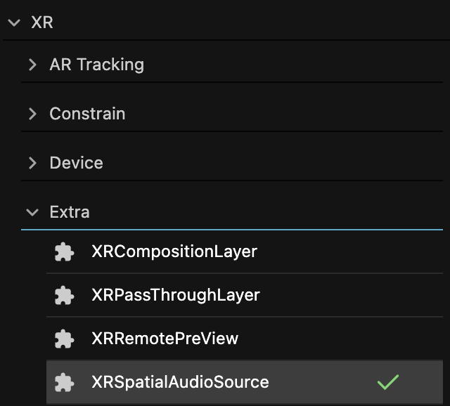

# XR 空间音频

XR 空间音频是虚拟现实领域中的一项重要技术，它可以模拟现实世界中的音频环境，让用户在虚拟现实环境中获得更加真实的听觉体验。基于头戴显示器的声音跟踪技术可以通过跟踪用户的头部运动来模拟现实世界中的音频环境。当用户在虚拟现实环境中移动头部时，系统可以根据用户的头部运动和位置来调整音频的位置和方向，从而模拟出现实世界中的音频环境。

## XR 空间音频功能

| 属性                   | 描述                             |
| ---------------------- | -------------------------------- |
| Clip                   | 引用需要挂载的音频文件。         |
| Loop                   | 是否循环播放音频。               |
| Play On Wake           | 是否在启动项目时自动播放音频。   |
| Volume                 | 音量大小。                       |
| Distance Rolloff Model | 音量根据距离效应进行衰减的模型。 |

## XR 空间音频使用

选择想要添加音频的节点对象，在属性管理器中添加组件：**XR > Extra > XRSpatialAudioSource**

## 声明

空间音频功能引用了 GoogleVR 库，许可凭证详见 licenses 文件夹中 LICENSE_googlevr.txt。

有关涵盖此 SDK 的谷歌 api 服务条款，请参阅 [https://developers.google.com/terms/](https://developers.google.com/terms/)。

> **注意**：使用空间音频功能需要扩展版本 **>=1.2.0**，编辑器版本 **>=3.7.3**。
